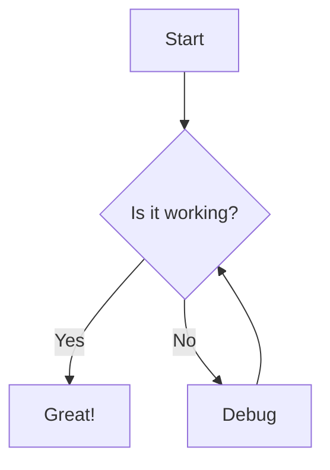

# Style Test Page

> This page displays all UI components and styles for visual consistency testing. It helps ensure that components look good across all color themes and work well together.

## Theme Colors
<div className="grid grid-cols-1 md:grid-cols-2 gap-4 my-6">
  <div className="p-6 border rounded-lg shadow-sm">
    <h3 className="text-lg font-medium mb-4">Background & Foreground</h3>
    <div className="w-full h-24 bg-background text-foreground flex items-center justify-center font-medium border">
      background with foreground text
    </div>
    <code className="text-xs mt-4 block">bg-background text-foreground</code>
  </div>

  <div className="p-6 border rounded-lg shadow-sm">
    <h3 className="text-lg font-medium mb-4">Card & Card Foreground</h3>
    <div className="w-full h-24 bg-card text-card-foreground flex items-center justify-center font-medium border">
      card with card-foreground text
    </div>
    <code className="text-xs mt-4 block">bg-card text-card-foreground</code>
  </div>

  <div className="p-6 border rounded-lg shadow-sm">
    <h3 className="text-lg font-medium mb-4">Primary & Primary Foreground</h3>
    <div className="w-full h-24 bg-primary text-primary-foreground flex items-center justify-center font-medium">
      primary with primary-foreground text
    </div>
    <code className="text-xs mt-4 block">bg-primary text-primary-foreground</code>
  </div>

  <div className="p-6 border rounded-lg shadow-sm">
    <h3 className="text-lg font-medium mb-4">Muted & Muted Foreground</h3>
    <div className="w-full h-24 bg-muted text-muted-foreground flex items-center justify-center font-medium">
      muted with muted-foreground text
    </div>
    <code className="text-xs mt-4 block">bg-muted text-muted-foreground</code>
  </div>

  <div className="p-6 border rounded-lg shadow-sm">
    <h3 className="text-lg font-medium mb-4">Accent & Accent Foreground</h3>
    <div className="w-full h-24 bg-accent text-accent-foreground flex items-center justify-center font-medium">
      accent with accent-foreground text
    </div>
    <code className="text-xs mt-4 block">bg-accent text-accent-foreground</code>
  </div>
</div>

<h3 className="text-lg font-medium my-4">Additional Color Combinations</h3>
<div className="grid grid-cols-1 md:grid-cols-3 gap-4 my-6">
  <div className="p-4 bg-muted text-primary flex items-center justify-center h-16 rounded-lg">
    bg-muted text-primary
  </div>
  <div className="p-4 bg-card text-primary flex items-center justify-center h-16 rounded-lg">
    bg-card text-primary
  </div>
  <div className="p-4 bg-accent text-primary flex items-center justify-center h-16 rounded-lg">
    bg-accent text-primary
  </div>
  <div className="p-4 bg-primary text-accent flex items-center justify-center h-16 rounded-lg">
    bg-primary text-accent
  </div>
  <div className="p-4 bg-background text-primary flex items-center justify-center h-16 rounded-lg">
    bg-background text-primary
  </div>
  <div className="p-4 bg-primary text-background flex items-center justify-center h-16 rounded-lg">
    bg-primary text-background
  </div>
</div>


## Headings

# Heading 1
## Heading 2
### Heading 3
#### Heading 4
##### Heading 5
###### Heading 6

<div className="badge-container">
    <a href="https://github.com/Mirascope/mirascope/actions/workflows/tests.yml" target="_blank"></a>
    <a href="https://codecov.io/github/Mirascope/mirascope" target="_blank"></a>
    <a href="https://mirascope.com/WELCOME" target="_blank"></a>
    <a href="https://pypi.python.org/pypi/mirascope" target="_blank"></a>
    <a href="https://pypi.python.org/pypi/mirascope" target="_blank"></a>
    <a href="https://github.com/Mirascope/mirascope/blob/dev/LICENSE"></a>
</div>

<div className="flex flex-wrap gap-4 my-6">
    <a href="./mirascope/getting-started/why" className="inline-flex items-center gap-2 px-4 py-2 rounded-md bg-primary text-white hover:bg-primary/90 transition-colors"><span className="material-icon">💡</span> Why Use Mirascope</a>
    <a href="https://join.slack.com/t/mirascope-community/shared_invite/zt-2ilqhvmki-FB6LWluInUCkkjYD3oSjNA" className="inline-flex items-center gap-2 px-4 py-2 rounded-md bg-primary text-white hover:bg-primary/90 transition-colors"><span className="material-icon">👥</span> Join Our Community</a>
    <a href="https://github.com/Mirascope/mirascope" className="inline-flex items-center gap-2 px-4 py-2 rounded-md bg-primary text-white hover:bg-primary/90 transition-colors"><span className="material-icon">⭐</span> Star the Repo</a>
</div>

```python
@llm.call(provider="$PROVIDER", model="$MODEL")
def get_capital(country: str) -> str:
    return f"What is the capital of {country}?"
```

```
The capital of Japan is Tokyo.
```
<TabbedSection showLogo={true}>
<Tab value="Shorthand">
```python
from mirascope import llm
from pydantic import BaseModel
```
</Tab>
<Tab value="Template">
```python
from mirascope import llm, prompt_template
from pydantic import BaseModel
```
</Tab>
</TabbedSection>

<ProviderCodeBlock 
  examplePath="mirascope/getting-started/quickstart/sdk"
  collapsible={true}
  headerText="Official SDK"
/>

## Text Formatting

Regular paragraph text. Lorem ipsum dolor sit amet, consectetur adipiscing elit. Nullam eget justo nec nisl tincidunt tincidunt.

**Bold text** and *italic text* and ~~strikethrough text~~.

A [link to somewhere](#) looks like this.

## Lists

Unordered list:
- Item 1
- Item 2
  - Nested item 2.1
  - Nested item 2.2
- Item 3

Ordered list:
1. First item
2. Second item
   1. Nested item 2.1
   2. Nested item 2.2
3. Third item

## Blockquotes

> This is a blockquote. It can span multiple lines and is useful for highlighting important information or quotes.

## Code

Inline `code` looks like this.

Code block:

```javascript
// JavaScript code example
function greeting(name) {
  console.log(`Hello, ${name}!`);
  return `Hello, ${name}!`;
}

greeting("World");
```

Python code:

```python
# Python code example
def greeting(name):
    print(f"Hello, {name}!")
    return f"Hello, {name}!"

greeting("World")
```

## Tables

<div className="overflow-x-auto">
  <table className="min-w-full divide-y divide-gray-200 my-6">
    <thead>
      <tr>
        <th className="px-4 py-2 bg-gray-50 dark:bg-gray-800 text-left text-sm font-medium">Name</th>
        <th className="px-4 py-2 bg-gray-50 dark:bg-gray-800 text-left text-sm font-medium">Type</th>
        <th className="px-4 py-2 bg-gray-50 dark:bg-gray-800 text-left text-sm font-medium">Default</th>
        <th className="px-4 py-2 bg-gray-50 dark:bg-gray-800 text-left text-sm font-medium">Description</th>
      </tr>
    </thead>
    <tbody>
      <tr>
        <td className="px-4 py-2 border-t border-gray-200 dark:border-gray-700">id</td>
        <td className="px-4 py-2 border-t border-gray-200 dark:border-gray-700">string</td>
        <td className="px-4 py-2 border-t border-gray-200 dark:border-gray-700">-</td>
        <td className="px-4 py-2 border-t border-gray-200 dark:border-gray-700">Unique identifier</td>
      </tr>
      <tr>
        <td className="px-4 py-2 border-t border-gray-200 dark:border-gray-700">name</td>
        <td className="px-4 py-2 border-t border-gray-200 dark:border-gray-700">string</td>
        <td className="px-4 py-2 border-t border-gray-200 dark:border-gray-700">-</td>
        <td className="px-4 py-2 border-t border-gray-200 dark:border-gray-700">Display name</td>
      </tr>
      <tr>
        <td className="px-4 py-2 border-t border-gray-200 dark:border-gray-700">enabled</td>
        <td className="px-4 py-2 border-t border-gray-200 dark:border-gray-700">boolean</td>
        <td className="px-4 py-2 border-t border-gray-200 dark:border-gray-700">false</td>
        <td className="px-4 py-2 border-t border-gray-200 dark:border-gray-700">Whether it's enabled</td>
      </tr>
      <tr>
        <td className="px-4 py-2 border-t border-gray-200 dark:border-gray-700">count</td>
        <td className="px-4 py-2 border-t border-gray-200 dark:border-gray-700">number</td>
        <td className="px-4 py-2 border-t border-gray-200 dark:border-gray-700">0</td>
        <td className="px-4 py-2 border-t border-gray-200 dark:border-gray-700">Item count</td>
      </tr>
    </tbody>
  </table>
</div>

# Custom Components

## Callouts

<Callout type="note">
  This is a default callout component.
</Callout>

<Note>
  This is a note callout for informational content.
</Note>

<Warning>
  This is a warning callout for important warnings.
</Warning>

<Info>
  This is an info callout for additional information.
</Info>

<Success>
  This is a success callout for positive outcomes.
</Success>


## Install Snippet

<InstallSnippet package="mirascope" />

## Mermaid Diagram



## Logos and Brand Elements

<Logo size="small" />
<Logo size="medium" />
<Logo size="large" />


## Cards

<div className="grid grid-cols-1 md:grid-cols-2 gap-4 my-6">
  <div className="p-4 border rounded-lg shadow-sm">
    <h3 className="text-lg font-medium mb-2">Pythonic By Design</h3>
    <p>Our design approach is to remain Pythonic so you can build your way</p>
  </div>
  <div className="p-4 border rounded-lg shadow-sm">
    <h3 className="text-lg font-medium mb-2">Editor Support & Type Hints</h3>
    <p>Rich autocomplete, inline documentation, and type hints to catch errors before runtime</p>
  </div>
  <div className="p-4 border rounded-lg shadow-sm">
    <h3 className="text-lg font-medium mb-2">Provider-Agnostic & Provider-Specific</h3>
    <p>Seamlessly engineer prompts agnostic or specific to various LLM providers</p>
  </div>
  <div className="p-4 border rounded-lg shadow-sm">
    <h3 className="text-lg font-medium mb-2">Comprehensive Tooling</h3>
    <p>Complete suite of tools for every aspect of working with LLM provider APIs</p>
  </div>
</div>
