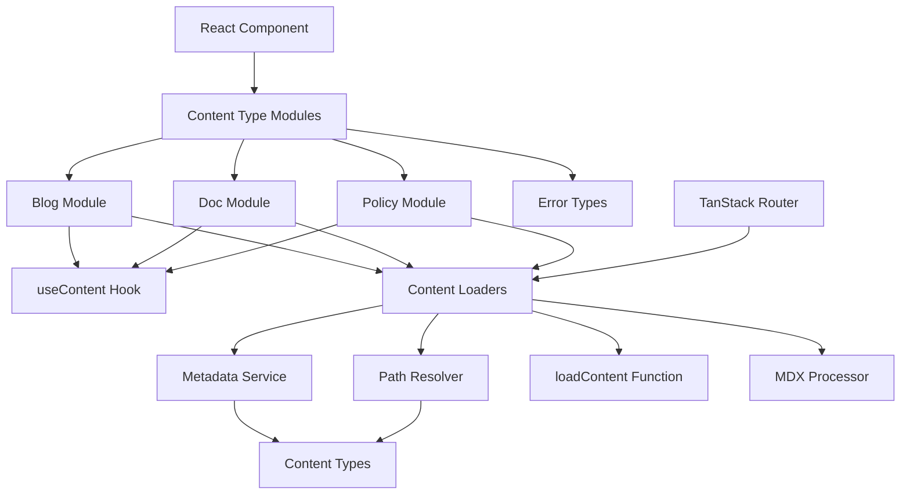

# Content System Design

This document outlines the architecture of the unified content system for handling docs, blog posts, and policy pages in the Mirascope website.

## System Overview

The content system provides a unified approach to loading, processing, and rendering various types of content with a cohesive, maintainable architecture. The system is centered around content-type specific modules, the TanStack Router integration via loaders, and a shared infrastructure layer for processing content.



## File Structure & Key Components

The system is organized into domain-specific modules with a shared infrastructure layer:

```
src/lib/content/
  ├── blog.ts                 # Blog-specific hooks, types, and API
  ├── content-loader.ts       # Core content loading logic
  ├── content-types.ts        # Shared type definitions
  ├── docs.ts                 # Docs-specific hooks, types, and API
  ├── environment.ts          # Environment detection utilities
  ├── errors.ts               # Error type definitions
  ├── frontmatter.ts          # Frontmatter parsing
  ├── index.ts                # Public API exports
  ├── loaders.ts              # TanStack Router loader integration
  ├── mdx-processor.ts        # MDX processing
  ├── metadata-service.ts     # Metadata handling
  ├── path-resolver.ts        # Path normalization/resolution
  ├── policy.ts               # Policy-specific hooks, types, and API
  ├── types.ts                # Core shared type definitions (legacy)
  └── useContent.ts           # Core content loading hook
```

Each module is focused on its specific responsibility:

### Domain-Specific Modules

The domain modules (blog.ts, docs.ts, policy.ts) contain:

1. Domain-specific content loading functions
2. Public API hooks and functions for accessing content
3. Metadata creation and validation

Key characteristics:
- Each provides utility functions for content loading and processing
- Each provides typed hooks and functions for components to use
- Each converts raw frontmatter into structured metadata

### Core Types (content-types.ts)

Defines the foundational types used throughout the content system:

```typescript
// Core content type enum
export type ContentType = "doc" | "blog" | "policy";

// Base metadata interface
export interface ContentMeta {
  title: string;
  description?: string;
  path: string;
  slug: string;
  type: ContentType;
}

// Type-specific metadata extensions
export interface DocMeta extends ContentMeta {
  product: string;
  section?: string;
  group?: string;
  sectionTitle?: string;
  groupTitle?: string;
}

export interface BlogMeta extends ContentMeta {
  date: string;
  author: string;
  readTime: string;
  lastUpdated?: string;
}

export interface PolicyMeta extends ContentMeta {
  lastUpdated?: string;
}

// Base content interface with metadata plus content
export interface Content<T extends ContentMeta = ContentMeta> {
  meta: T; // Typed, validated metadata
  content: string; // Raw MDX with frontmatter stripped
  
  // MDX structure expected by components
  mdx: {
    code: string;
    frontmatter: Record<string, any>;
  };
}

// Result type for content operations
export interface ContentResult<T extends ContentMeta = ContentMeta> {
  content: Content<T> | null;
  loading: boolean;
  error: Error | null;
}
```

### Content Loading (content-loader.ts)

The core function for loading and processing content:

```typescript
/**
 * Unified content loading pipeline that handles the entire process
 * from path resolution to MDX processing and metadata creation
 */
export async function loadContent<T extends ContentMeta>(
  path: string,
  contentType: ContentType,
  createMeta: (frontmatter: Record<string, any>, path: string) => T,
  options?: {
    preprocessContent?: (content: string) => string;
  }
): Promise<Content<T>>;
```

### Environment (environment.ts)

Provides environment detection and fetch utilities:

```typescript
/**
 * Environment utilities for content loading system
 */
export const environment = {
  isDev: () => import.meta.env?.DEV ?? false,
  isProd: () => import.meta.env?.PROD ?? false,
  getMode: () => (import.meta.env?.DEV ? "development" : "production"),
  fetch: (...args: Parameters<typeof fetch>) => fetch(...args),
};
```

### Content Hook (useContent.ts)

The base React hook for loading and processing content:

```typescript
/**
 * Base hook for loading and processing content
 */
export function useContent<T extends ContentMeta>(
  path: string,
  getContent: GetContentFn<T>
): ContentResult<T>;
```

### TanStack Router Integration (loaders.ts)

Integrates with TanStack Router by providing loader functions:

```typescript
/**
 * Creates a content loader function compatible with TanStack Router
 */
function createContentLoader<T extends ContentMeta>(
  getContentFn: GetContentFn<T>,
  contentType: ContentType
) {
  return ({ params }: RouteParams) => {
    const path = getPathFromParams(params, contentType);
    return getContentFn(path);
  };
}

// Policy loaders
export const policyLoader = createContentLoader(getPolicy, "policy");

// Doc loaders
export const docLoader = createContentLoader(getDocContent, "doc");

// Blog loaders
export const blogLoader = createContentLoader(getBlogContent, "blog");
```

### Domain Implementations

Each domain provides specific implementations:

```typescript
// Example from blog.ts
export interface BlogMeta extends ContentMeta {
  date: string;
  author: string;
  readTime: string;
  lastUpdated?: string;
}

export type BlogContent = Content<BlogMeta>;

/**
 * Create metadata from frontmatter for blog posts
 */
function createBlogMeta(frontmatter: Record<string, any>, path: string): BlogMeta;

/**
 * Get blog content by path
 */
export async function getBlogContent(slug: string): Promise<BlogContent>;

/**
 * Get all blog metadata
 */
export async function getAllBlogMeta(): Promise<BlogMeta[]>;
```

## Data Flow

### Route-based Content Loading
1. TanStack Router calls the route loader (e.g., `blogLoader`)
2. The loader:
   - Extracts path parameters from the route
   - Resolves the path using `getPathFromParams`
   - Calls the domain's content function (e.g., `getBlogContent`) 
3. The domain content function:
   - Normalizes the content path if needed
   - Calls the unified `loadContent` function
   - Passes domain-specific metadata creation function
4. The `loadContent` function:
   - Validates the path
   - Determines the environment (dev/prod)
   - Resolves the full content path
   - Fetches raw content using environment.fetch
   - Processes the MDX content
   - Creates typed metadata using the domain-specific function
   - Validates the metadata
   - Returns the complete Content object
5. Component receives the loader data through `useLoaderData`
6. Component renders the content using the MDX renderer

### Hook-based Content Loading
1. Component calls domain-specific hook (e.g., `usePolicy(path)`)
2. Hook calls `useContent` with the domain's `getContent` function
3. The `useContent` hook:
   - Manages loading state and error handling
   - Calls the provided `getContent` function
   - Returns the result with appropriate loading/error states
4. The rest of the flow follows the same pattern as route-based loading

## Caching Strategy

TanStack Router provides built-in caching:

- Router automatically caches loader results
- Revalidation and cache invalidation are handled by TanStack Router
- Cache time can be configured at the route level
- Concurrent requests are de-duplicated automatically

## MDX Processing

The content processing pipeline:

1. Raw content is loaded using `environment.fetch`
2. For development, content is fetched directly
3. For production, content is loaded from pre-compiled JSON
4. MDX is processed using the `processMDXContent` function
5. Processed content is returned with metadata for rendering

## Error Handling Philosophy

1. **Specific Error Types**: Custom error classes in errors.ts
2. **Graceful Recovery**: Components and hooks handle error states
3. **Detailed Error Context**: Errors include path, content type, and specific error details
4. **Consistent State Management**: Loading and error states follow a standard pattern

## Design Principles

1. **Environment Abstraction**: The environment.ts module abstracts environment details
2. **Functional Architecture**: Pure functions with clear inputs and outputs
3. **Type Safety**: Comprehensive TypeScript types throughout the system
4. **Router Integration**: Seamless integration with TanStack Router
5. **Domain Separation**: Clear boundaries between different content domains
6. **Performance**: Optimized loading and caching strategies

## Future Extensions

The system is designed to accommodate future enhancements:

1. **Content Search**: Foundation for implementing search functionality
2. **Static Site Generation**: Compatible with build-time data loading
3. **Internationalization**: Extensible for multi-language content
4. **Advanced MDX Features**: Support for more complex MDX processing
5. **Server Components**: Ready for React Server Components integration