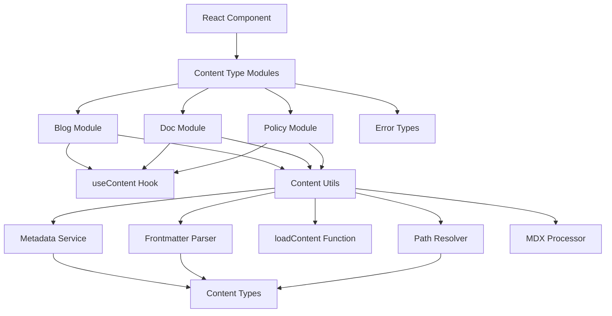

# Content System Design

This document outlines the architecture of the unified content system for handling docs, blog posts, and policy pages in the Mirascope website.

## System Overview

The content system provides a unified approach to loading, processing, and rendering various types of content with a cohesive, maintainable architecture. The architecture follows functional programming principles with content-type specific modules.



## File Structure & Key Components

The system is organized into domain-specific modules with a shared infrastructure layer:

```
src/lib/content/
  ├── blog.ts                  # Blog-specific hooks, types, and API
  ├── docs.ts                  # Docs-specific hooks, types, and API
  ├── policy.ts                # Policy-specific hooks, types, and API 
  ├── types.ts                 # Core shared type definitions
  ├── errors.ts                # Error type definitions
  ├── utils.ts                 # Shared utility functions
  ├── content-loader.ts        # Content loading logic
  ├── frontmatter.ts           # Frontmatter parsing
  ├── mdx-processor.ts         # MDX processing
  ├── metadata-service.ts      # Metadata handling
  ├── path-resolver.ts         # Path normalization/resolution
  └── useContent.ts            # Core content loading hook
```

Each module is focused on its specific responsibility:

### Domain-Specific Modules

The domain modules (blog.ts, docs.ts, policy.ts) contain:

1. Domain-specific metadata type definitions
2. Domain-specific content loading functions
3. Public API hooks and functions for accessing content

Key characteristics:
- Each domain maintains its own metadata types that extend the base ContentMeta
- Each provides a set of utility functions for content loading and processing
- Each provides typed hooks and functions for components to use

### Core Types (types.ts)

Defines the foundational types used throughout the content system.

```typescript
// Core content type enum
export type ContentType = "doc" | "blog" | "policy";

// Base metadata interface
export interface ContentMeta {
  title: string;
  description?: string;
  path: string;
  slug: string;
  type: ContentType;
}

// Base content interface with metadata plus content
export interface Content<T extends ContentMeta = ContentMeta> {
  meta: T;                         // Typed, validated metadata
  content: string;                 // Raw MDX with frontmatter stripped
  
  // MDX structure expected by components
  mdx: {
    code: string;
    frontmatter: Record<string, any>;
  };
}

// Result of validation
export interface ValidationResult {
  isValid: boolean;
  errors?: string[];
}

// Result type for content operations
export interface ContentResult<T extends ContentMeta = ContentMeta> {
  content: Content<T> | null;
  loading: boolean;
  error: Error | null;
}

// Type for content retrieval function
export type GetContentFn<T extends ContentMeta> = (
  path: string, 
  options?: { customFetch?: typeof fetch, devMode?: boolean }
) => Promise<Content<T>>;

// Type for metadata retrieval function
export type GetMetaFn<T extends ContentMeta> = () => Promise<T[]>;
```

### Content Loading (content-loader.ts)

The core function for loading content:

```typescript
/**
 * Loads content for the given path and content type
 */
export async function loadContent(
  path: string, 
  contentType: ContentType, 
  options?: {
    customFetch?: typeof fetch,
    devMode?: boolean
  }
): Promise<string>;
```

### Utilities (utils.ts)

Provides shared utility functions for all domain modules.

```typescript
/**
 * Load content by path
 */
export async function loadContent<T extends ContentMeta>(
  path: string,
  contentType: ContentType,
  createMeta: (frontmatter: Record<string, any>, path: string) => T,
  options?: {
    customFetch?: typeof fetch,
    devMode?: boolean
  },
  postprocessContent?: (content: string) => string
): Promise<Content<T>>;
```

### Content Hook (useContent.ts)

The base React hook for loading and processing content.

```typescript
/**
 * Base hook for loading and processing content
 */
export function useContent<T extends ContentMeta>(
  path: string,
  getContent: GetContentFn<T>
): ContentResult<T>;
```

### Domain Implementations

Each domain provides a set of functions:

```typescript
// Example from policy.ts
export interface PolicyMeta extends ContentMeta {
  lastUpdated?: string;
}

export type PolicyContent = Content<PolicyMeta>;

/**
 * Create metadata from frontmatter for policies
 */
function createPolicyMeta(frontmatter: Record<string, any>, path: string): PolicyMeta;

/**
 * Clean up source mappings in policy content
 */
function cleanupPolicyContent(content: string): string;

/**
 * Get policy content by path
 */
export function getPolicyContent(
  path: string, 
  options?: ContentLoaderOptions
): Promise<PolicyContent>;

/**
 * Hook for loading and rendering a policy page
 */
export function usePolicy(path: string): ContentResult<PolicyMeta>;

/**
 * Get a policy by path
 */
export function getPolicy(path: string, options?: ContentLoaderOptions): Promise<PolicyContent>;

/**
 * Get all policy metadata
 */
export function getAllPolicyMeta(options?: ContentLoaderOptions): Promise<PolicyMeta[]>;
```

## Data Flow

1. Component calls domain-specific hook (e.g. `usePolicy(path)`)
2. Hook calls `useContent` with the domain's `getContent` function
3. The `useContent` hook:
   - Manages loading state and error handling
   - Calls the provided `getContent` function
   - Returns the result with appropriate loading/error states
4. The domain's `getContent` function:
   - Calls the shared `loadContent` utility
   - Passes domain-specific methods for metadata creation and content processing
5. The `loadContent` utility:
   - Loads raw content via the fetch implementation (browser fetch or customFetch)
   - Extracts frontmatter
   - Creates metadata using the domain-specific function
   - Processes MDX content
   - Returns the complete Content object
6. Component renders the content, using the MDX renderer with the processed code

## Caching Strategy

TanStack Router provides built-in caching that makes our custom caching unnecessary:

- Router automatically caches loader results
- Revalidation and cache invalidation are handled by TanStack Router
- Cache time can be configured at the route level
- Concurrent requests are de-duplicated automatically

## MDX Processing

Content goes through a multi-step processing pipeline:

1. Raw content is loaded from the source
2. Frontmatter is extracted and parsed
3. Domain-specific pre-processing is applied if needed
4. MDX content is processed using next-mdx-remote/serialize
5. Processed content is stored with metadata for rendering

## Error Handling Philosophy

1. **Specific Errors**: Custom error types for different scenarios
2. **Graceful Recovery**: Components handle error states appropriately
3. **Detailed Information**: Errors include path, content type, and context
4. **Proper State Management**: Loading and error states are clearly represented

## Design Principles

1. **Functional Programming**: Pure functions with clear inputs and outputs
2. **Composition**: Small, focused functions that can be composed together
3. **Separation of Concerns**: Clear responsibilities for each module
4. **Type Safety**: Full TypeScript type coverage for improved reliability
5. **Performance Focus**: Leverage TanStack Router's caching for efficient processing
6. **Dependency Injection**: Environment-specific concerns handled via options

## Future Extensions

The system is designed to accommodate future enhancements:

1. **Content Search**: Foundation for implementing search functionality
2. **Static Site Generation**: Compatible with build-time data loading
3. **Internationalization**: Extensible for multi-language content
4. **Enhanced MDX Processing**: Support for more advanced MDX features
5. **Server Components**: Support for React Server Components