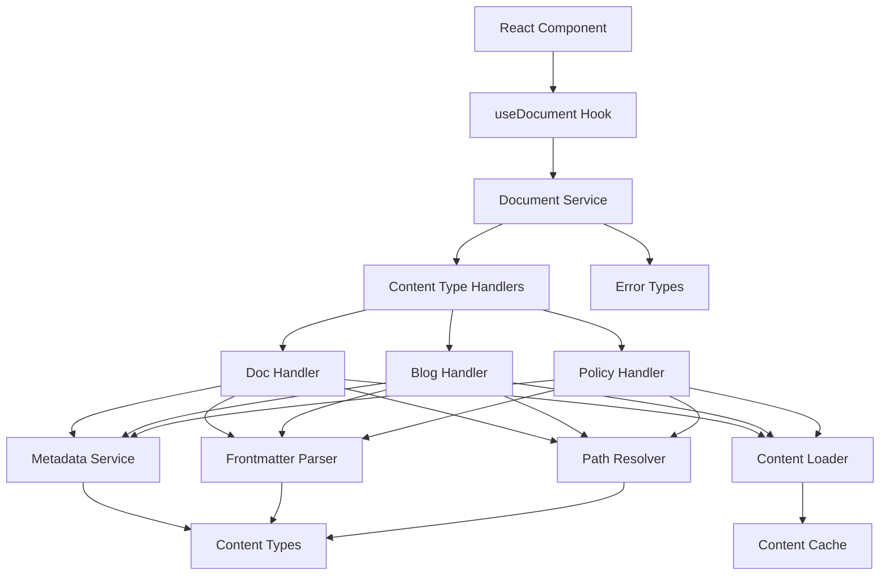

# Content System Design

This document outlines the architecture of the unified content system for handling docs, blog posts, and policy pages in the Mirascope website.

## System Overview

The content system provides a unified approach to loading, processing, and rendering various types of content with a cohesive, maintainable architecture.



## File Structure & Key Interfaces

The system is organized into modular components, each with a specific responsibility:

### `content-types.ts`

Defines the foundational types used throughout the content system.

```typescript
// Core content type enum
export type ContentType = 'doc' | 'blog' | 'policy';

// Base metadata interface
export interface ContentMeta {
  title: string;
  description?: string;
  path: string;
  slug: string;
  type: ContentType;
}

// Document with its metadata
export interface ContentWithMeta {
  meta: ContentMeta;
  content: string;
}

// Result of document validation
export interface ValidationResult {
  isValid: boolean;
  errors?: string[];
}

// Type-specific metadata extensions
export interface DocMeta extends ContentMeta {
  product: string;
  section?: string;
  group?: string;
  sectionTitle?: string;
  groupTitle?: string;
}

export interface BlogMeta extends ContentMeta {
  date: string;
  author: string;
  readTime: string;
  lastUpdated?: string;
}

export interface PolicyMeta extends ContentMeta {
  lastUpdated?: string;
}

// Type-specific document types
export type DocWithContent = ContentWithMeta & { meta: DocMeta };
export type BlogWithContent = ContentWithMeta & { meta: BlogMeta };
export type PolicyWithContent = ContentWithMeta & { meta: PolicyMeta };
```

### `errors.ts`

Defines custom error types for standardized error handling.

```typescript
export class ContentError extends Error {
  constructor(
    message: string,
    public contentType: ContentType,
    public path?: string
  ) {
    super(message);
    this.name = 'ContentError';
  }
}

export class DocumentNotFoundError extends ContentError {
  constructor(contentType: ContentType, path: string) {
    super(`${contentType} document not found: ${path}`, contentType, path);
    this.name = 'DocumentNotFoundError';
  }
}

export class InvalidPathError extends ContentError {
  constructor(contentType: ContentType, path: string) {
    super(`Invalid ${contentType} path: ${path}`, contentType, path);
    this.name = 'InvalidPathError';
  }
}

export class ContentLoadError extends ContentError {
  constructor(contentType: ContentType, path: string, cause?: Error) {
    super(
      `Failed to load ${contentType} content: ${path}${cause ? ` - ${cause.message}` : ''}`,
      contentType,
      path
    );
    this.name = 'ContentLoadError';
    this.cause = cause;
  }
}

export class MetadataError extends ContentError {
  constructor(contentType: ContentType, path: string, cause?: Error) {
    super(
      `Failed to process ${contentType} metadata: ${path}${cause ? ` - ${cause.message}` : ''}`,
      contentType,
      path
    );
    this.name = 'MetadataError';
    this.cause = cause;
  }
}
```

### `path-resolver.ts`

Handles path normalization and validation for different content types.

```typescript
export function normalizePath(path: string, contentType: ContentType): string {
  // Convert URL paths to file system paths
  // e.g., /docs/mirascope/getting-started -> mirascope/getting-started.mdx
}

export function buildFilePath(path: string, contentType: ContentType): string {
  // Convert normalized path to actual file path
  // e.g., mirascope/getting-started.mdx -> /src/docs/mirascope/getting-started.mdx
}

export function isValidPath(path: string, contentType: ContentType): boolean {
  // Validate that a path is well-formed for a content type
}

export function getStaticPath(path: string, contentType: ContentType): string {
  // Generate static file path for production
  // e.g., mirascope/getting-started.mdx -> /static/docs/mirascope/getting-started.json
}
```

### `frontmatter.ts`

Parses and extracts frontmatter from document content.

```typescript
export interface FrontmatterResult {
  frontmatter: Record<string, any>;
  content: string;
}

export function parseFrontmatter(content: string): FrontmatterResult {
  // Extract frontmatter from --- delimited sections
  // Return parsed frontmatter and clean content
}

export function validateFrontmatter(
  frontmatter: Record<string, any>,
  contentType: ContentType
): ValidationResult {
  // Validate that frontmatter has required fields for content type
}

export function mergeFrontmatter(
  target: Record<string, any>,
  source: Record<string, any>,
  overwrite = false
): Record<string, any> {
  // Combine frontmatter from multiple sources
}
```

### `content-cache.ts`

Provides unified caching for content to improve performance.

```typescript
export interface CacheEntry {
  content: string;
  timestamp: number;
  expires?: number;
}

export interface CacheOptions {
  maxSize?: number;
  defaultExpiration?: number;
  enabled?: boolean;
}

export class ContentCache {
  constructor(options?: CacheOptions);

  get(contentType: ContentType, key: string): string | null;
  
  set(contentType: ContentType, key: string, content: string, expiration?: number): void;
  
  invalidate(contentType?: ContentType, pattern?: string): void;
  
  getStats(): {
    size: number;
    hits: number;
    misses: number;
    hitRate: number;
  };
}

// Factory function
export function createContentCache(options?: CacheOptions): ContentCache;
```

### `metadata-service.ts`

Extracts and processes metadata from content and structure definitions.

```typescript
export function getMetadataFromStructure(
  path: string,
  contentType: ContentType
): ContentMeta {
  // Extract metadata from structure definitions (_meta.ts, etc.)
}

export function extractMetadataFromFrontmatter(
  frontmatter: Record<string, any>,
  contentType: ContentType,
  path: string
): Partial<ContentMeta> {
  // Convert frontmatter to typed metadata
}

export function mergeMetadata<T extends ContentMeta>(
  structureMeta: T,
  frontmatterMeta: Partial<T>
): T {
  // Merge metadata from multiple sources with proper precedence
}

export function validateMetadata(
  metadata: ContentMeta,
  contentType: ContentType
): ValidationResult {
  // Validate that metadata meets requirements for content type
}
```

### `content-loader.ts`

Handles loading content from different sources based on environment.

```typescript
export interface ContentLoaderOptions {
  cache?: ContentCache;
  devMode?: boolean;
}

export class ContentLoader {
  constructor(options?: ContentLoaderOptions);

  async loadContent(
    path: string,
    contentType: ContentType
  ): Promise<string>;
}

// Factory function
export function createContentLoader(options?: ContentLoaderOptions): ContentLoader;
```

### `handlers/content-type-handler.ts`

Defines the interface that each content type handler must implement, ensuring type safety and consistency.

```typescript
/**
 * Interface for type-specific content handlers
 */
export interface ContentTypeHandler<T extends ContentMeta> {
  /**
   * Retrieves a document by path
   */
  getDocument(path: string): Promise<ContentWithMeta & { meta: T }>;
  
  /**
   * Gets all documents of this content type
   */
  getAllDocuments(filter?: (meta: T) => boolean): Promise<T[]>;
  
  /**
   * Gets documents for a specific collection
   */
  getDocumentsForCollection(collection: string): Promise<T[]>;
}

/**
 * Type mapping from content types to their corresponding metadata types
 */
export type ContentTypeToMeta<T extends ContentType> = 
  T extends 'doc' ? DocMeta :
  T extends 'blog' ? BlogMeta :
  T extends 'policy' ? PolicyMeta :
  never;

/**
 * Map of content types to their handlers, ensuring all content types are covered
 */
export type ContentTypeHandlerMap = {
  [K in ContentType]: ContentTypeHandler<ContentTypeToMeta<K>>;
};
```

### `handlers/doc-content-handler.ts`

Implements the ContentTypeHandler interface for documentation.

```typescript
export class DocContentHandler implements ContentTypeHandler<DocMeta> {
  private loader: ContentLoader;
  private cache: ContentCache;

  constructor(loader: ContentLoader, cache?: ContentCache) {
    this.loader = loader;
    this.cache = cache || createContentCache();
  }

  async getDocument(path: string): Promise<ContentWithMeta & { meta: DocMeta }> {
    // Implementation that loads doc content with proper caching
  }

  async getAllDocuments(filter?: (meta: DocMeta) => boolean): Promise<DocMeta[]> {
    // Implementation that returns all docs
  }

  async getDocumentsForCollection(product: string): Promise<DocMeta[]> {
    // Implementation that returns docs for a specific product
  }

  // Doc-specific helper methods
  async getDocsForSection(product: string, section: string): Promise<DocMeta[]> { /*...*/ }
  async getDocsForGroup(product: string, group: string): Promise<DocMeta[]> { /*...*/ }
  getSectionsForProduct(product: string): { slug: string; title: string }[] { /*...*/ }
  getDocsForProduct(product: string): DocMeta[] { /*...*/ }
}

// Factory function
export function createDocContentHandler(): DocContentHandler { /*...*/ }

// Singleton instance
export const docContentHandler = createDocContentHandler();
```

### `handlers/blog-content-handler.ts`

Implements the ContentTypeHandler interface for blog posts.

```typescript
export class BlogContentHandler implements ContentTypeHandler<BlogMeta> {
  private loader: ContentLoader;
  private cache: ContentCache;

  constructor(loader: ContentLoader, cache?: ContentCache) {
    this.loader = loader;
    this.cache = cache || createContentCache();
  }

  async getDocument(path: string): Promise<ContentWithMeta & { meta: BlogMeta }> {
    // Implementation that loads blog content with proper caching
  }

  async getAllDocuments(filter?: (meta: BlogMeta) => boolean): Promise<BlogMeta[]> {
    // Implementation that returns all blog posts, sorted by date
  }

  async getDocumentsForCollection(collection: string): Promise<BlogMeta[]> {
    // Implementation that returns blog posts for a specific collection (tag, category, etc)
  }
}

// Factory function
export function createBlogContentHandler(): BlogContentHandler { /*...*/ }

// Singleton instance
export const blogContentHandler = createBlogContentHandler();
```

### `handlers/policy-content-handler.ts`

Implements the ContentTypeHandler interface for policy pages.

```typescript
export class PolicyContentHandler implements ContentTypeHandler<PolicyMeta> {
  private loader: ContentLoader;
  private cache: ContentCache;

  constructor(loader: ContentLoader, cache?: ContentCache) {
    this.loader = loader;
    this.cache = cache || createContentCache();
  }

  async getDocument(path: string): Promise<ContentWithMeta & { meta: PolicyMeta }> {
    // Implementation that loads policy content with proper caching
  }

  async getAllDocuments(filter?: (meta: PolicyMeta) => boolean): Promise<PolicyMeta[]> {
    // Implementation that returns all policy pages
  }

  async getDocumentsForCollection(collection: string): Promise<PolicyMeta[]> {
    // Implementation that returns policy pages for a specific collection (e.g., terms)
  }
}

// Factory function
export function createPolicyContentHandler(): PolicyContentHandler { /*...*/ }

// Singleton instance
export const policyContentHandler = createPolicyContentHandler();
```

### `document-service.ts`

The main service that orchestrates the entire content loading process.

```typescript
export interface DocumentServiceOptions {
  loader?: ContentLoader;
  cache?: ContentCache;
  devMode?: boolean;
}

export class DocumentService {
  private handlers: ContentTypeHandlerMap;

  constructor(options?: DocumentServiceOptions) {
    this.handlers = {
      'doc': createDocContentHandler(),
      'blog': createBlogContentHandler(),
      'policy': createPolicyContentHandler()
    };
  }

  async getDocument<T extends ContentType>(
    path: string, 
    contentType: T
  ): Promise<ContentWithMeta & { meta: ContentTypeToMeta<T> }> {
    return this.handlers[contentType].getDocument(path) as any;
  }

  async getAllDocuments<T extends ContentType>(
    contentType: T,
    filter?: (meta: ContentTypeToMeta<T>) => boolean
  ): Promise<ContentTypeToMeta<T>[]> {
    return this.handlers[contentType].getAllDocuments(filter as any) as any;
  }

  async getDocumentsForCollection<T extends ContentType>(
    contentType: T,
    collection: string
  ): Promise<ContentTypeToMeta<T>[]> {
    return this.handlers[contentType].getDocumentsForCollection(collection) as any;
  }
}

// Factory function
export function createDocumentService(options?: DocumentServiceOptions): DocumentService;
```

### `hooks/useDocument.ts`

React hook for loading documents in components.

```typescript
export interface UseDocumentOptions {
  initialData?: ContentWithMeta;
  suspense?: boolean;
}

export function useDocument<T extends ContentType>(
  path: string,
  contentType: T,
  options?: UseDocumentOptions
): {
  document: (ContentWithMeta & { meta: ContentTypeToMeta<T> }) | null;
  loading: boolean;
  error: Error | null;
};

export function useDocumentCollection<T extends ContentType>(
  contentType: T,
  collection?: string,
  options?: UseDocumentOptions
): {
  documents: ContentTypeToMeta<T>[];
  loading: boolean;
  error: Error | null;
};
```

### `hooks/useMDXContent.ts`

React hook for processing MDX content.

```typescript
export function useMDXContent(
  document: ContentWithMeta | null,
  options?: {
    fallback?: boolean;
  }
): {
  compiledMDX: {
    code: string;
    frontmatter: Record<string, any>;
  } | null;
  processing: boolean;
  error: Error | null;
};
```

## Data Flow

1. Component calls `useDocument(path, contentType)`
2. Hook calls `documentService.getDocument(path, contentType)`
3. Document service delegates to the appropriate content type handler
4. The handler:
   - Checks cache for content 
   - If not cached, loads content using `contentLoader`
   - Extracts frontmatter using `frontmatterParser`
   - Gets structure metadata using `metadataService`
   - Merges frontmatter and structure metadata
   - Returns complete document with metadata
5. Component renders the document using `useMDXContent` for processing

## Caching Strategy

The content cache is designed for optimal performance:

- **Cache Key**: `${contentType}:${specificKey}`
- **Cache Entry**: `{ content: string, timestamp: number, expires?: number }`
- **Expiration Policy**:
  - Development: 5 minutes by default (configurable)
  - Production: No expiration by default (configurable)
- **Eviction Policy**: LRU (Least Recently Used)
- **Size Limits**: Maximum 100 entries by default (configurable)
- **Cache Control**: Ability to invalidate by pattern matching

## Environment Handling

The system adapts to different environments:

- **Development**:
  - Content loaded via API
  - Short cache expiration to reflect changes
  - More verbose error reporting
  
- **Production**:
  - Pre-compiled static JSON files
  - Long-term caching
  - Streamlined error handling
  
- **Testing**:
  - Mock content for predictable tests
  - Ability to inject test content
  - Flexible configuration for different test scenarios

### Implementation Strategy for Environment Handling

- **Encapsulation**: Environment-specific logic is encapsulated within each service module
- **Unified API**: Services expose a consistent API regardless of environment
- **Internal Detection**: Modules detect the environment internally rather than requiring consumers to handle it
- **Configuration**: Environment-specific defaults are applied automatically, with the ability to override them
- **Abstraction**: Consumers should not need to know which environment they're in to use the services correctly

## Error Handling Philosophy

1. **Early Validation**: Validate inputs at the earliest possible point
2. **Specific Errors**: Use custom error types for different scenarios
3. **Graceful Fallbacks**: Provide sensible defaults when possible
4. **Comprehensive Information**: Include path, content type, and context in errors
5. **Developer Experience**: Detailed error messages in development

## Future Extensions

The system is designed to accommodate future enhancements:

1. **Server Components**: Support for React Server Components
2. **Static Site Generation**: Compatible with build-time data loading
3. **Internationalization**: Extensible for multi-language content
4. **Content Search**: Foundation for implementing search functionality
5. **Content API**: Potential to expose content through an API